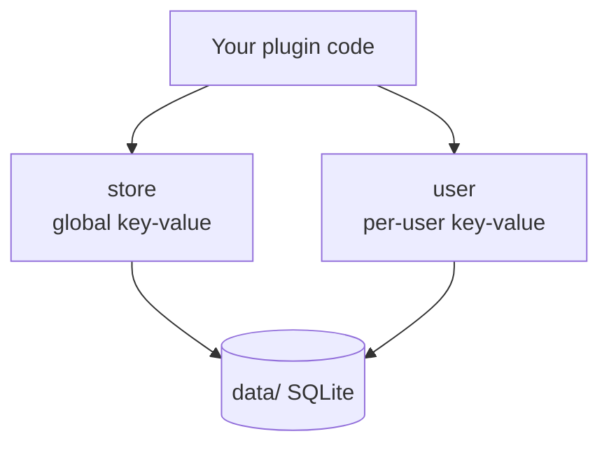

A plugin often needs to remember things between requests: a counter, a user's to-do list, a cached token. You don't bring your own database for this. The Cat ships two ready key-value stores you reach from the front door, one shared and one per-user:

```python
from cat import store, user

await store.save("theme", {"color": "dark"})   # shared by everyone
await user.save("todos", [{"text": "buy milk"}])  # private to the caller
```

Both live in the Cat's SQLite database (under `data/`), so a [backup](/docs/production/administrators/backups-updates/) of the project folder carries them along.



## The global store

`store` is one key-value space shared across the whole installation. Every agent, endpoint and directive sees the same values. Reach it as the ambient `store`:

```python
from cat import store

await store.save("theme", {"color": "dark"})
theme = await store.load("theme")          # {"color": "dark"}, or None if unset
await store.load("theme", {})              # pass a default for the unset case
await store.exists("theme")                # True / False
await store.delete("theme")                # True if something was removed
```

`save` is a **full replacement**, not a merge: to change a collection, load it, edit it, save it back.

```python
counts = await store.load("counts", {})
counts["hits"] = counts.get("hits", 0) + 1
await store.save("counts", counts)
```

## The per-user store

`user` is the *same* key-value API, but every key is scoped to the person behind the current request. Two users never see each other's data, and you never pass a user id around, the ambient `user` already knows who is calling:

```python
from cat import user

todos = await user.load("todos", [])
todos.append({"text": "buy milk", "done": False})
await user.save("todos", todos)            # stored under this user only
await user.delete("todos")
```

Because it resolves the caller, `user` is only available where there is a request: inside [tools](/docs/plugins/tools/), [endpoints](/docs/plugins/endpoints/), [directives](/docs/plugins/directives/) and the request [hooks](/docs/plugins/hooks/). It raises in the bootstrap hooks, which run with no request in flight. See [User Management](/docs/production/auth/user-management/) for who that user is.

## What you can store

Any JSON-serializable value: numbers, strings, booleans, lists, dicts. Types round-trip, an `int` comes back an `int`, not `"9"`. The two usual JSON coercions apply: tuples come back as lists, and non-string dict keys come back as strings.

```python
await store.save("count", 9)
await store.load("count")                  # 9  (int, not "9")
```

## Which persistence do I want?

The two stores are for **runtime state your code reads and writes**. The Cat has two other persistence flavors for different jobs:

| Need | Use |
|------|-----|
| Shared state across all users | `store` |
| State private to each user | `user` |
| Configuration an admin edits in the UI | [Plugin Settings](/docs/plugins/settings/) |
| Semantic recall over text (RAG) | [Vector Memory](/docs/faq/llm-concepts/vector-memory/) |
