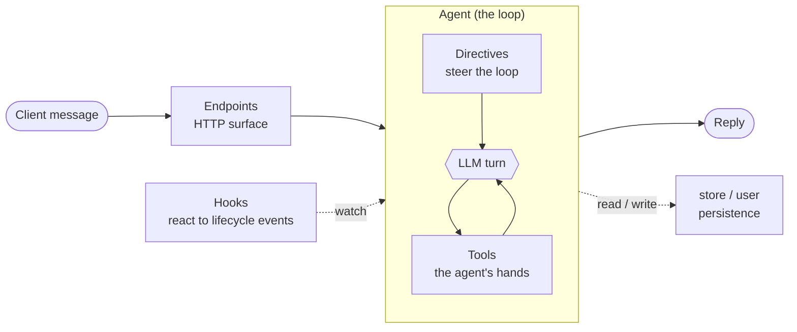

You now have an empty plugin. What can you put in it? A plugin extends the Cat through a handful of **primitives**, each a small Python class or decorated function the Cat discovers at startup. Everything comes from a single front door:

```python
from cat import Agent, tool, Directive, hook, endpoint, store, user, log
```

This page is the map. Each primitive links to its full reference in the [Plugins](/docs/plugins/plugins/) section.

## The mental model

An agent is a **loop**: it reads the conversation, optionally calls tools, and answers. The other primitives sit around that loop, some steer it, some watch it, some expose it to the outside world.



> An agent is a loop. Tools are its hands. Directives hook the loop. Hooks react to the lifecycle. Endpoints open the door.

## The primitives at a glance

| Primitive | What it is | Reach for it when |
|-----------|------------|-------------------|
| **[Agent](/docs/plugins/agents/)** | A loop with a `system_prompt`, some tools and some directives. Subclass `Agent`, give it a `slug`, clients talk to it. | You want something to talk to. |
| **[Tool](/docs/plugins/tools/)** | A method decorated with `@tool` the LLM can decide to call. Its docstring and type hints are the manual the LLM reads. | The agent needs to *do* something: query a DB, hit an API. |
| **[Directive](/docs/plugins/directives/)** | Reusable middleware over the loop (`start` / `step` / `finish`). RAG, memory and guardrails are all just directives. | You need to touch the agent itself, per turn. |
| **[Hook](/docs/plugins/hooks/)** | A data-only reaction to a global lifecycle event (message in, message out, app boot). Never sees the agent. | You react to the pipeline and don't need the agent. |
| **[Custom Endpoint](/docs/plugins/endpoints/)** | Extend the REST API with `@endpoint.get/post/...`, guarded by a single `role=` kwarg. | You want your own HTTP routes. |
| **[Persistence](/docs/plugins/persistence/)** | Two key-value stores from the front door: `store` (shared) and `user` (per person). | You need to remember state between requests. |
| **[Settings](/docs/plugins/settings/)** | A pydantic schema the Cat renders as a form in the admin UI. | An admin should configure your plugin. |
| **[Dependencies](/docs/plugins/dependencies/)** | A `requirements.txt` the Cat installs with the plugin. | Your plugin needs extra Python packages. |
| **[Logging](/docs/plugins/logging/)** | `from cat import log` — level-aware, colorized console logging. | You want to trace what your plugin does. |

## Directive or hook?

The one distinction people trip on: both extend behaviour, but only one gets the agent.

- Need to touch the agent (its prompt, its tools, its result)? Write a **[Directive](/docs/plugins/directives/)**, agent-scoped, opt-in.
- Just reacting to a pipeline event, no agent involved? Write a **[Hook](/docs/plugins/hooks/)**, data-only.

## Where to go next

Start with an [Agent](/docs/plugins/agents/) and give it a [Tool](/docs/plugins/tools/), that is a complete, useful plugin. From there, add [Directives](/docs/plugins/directives/), [Hooks](/docs/plugins/hooks/), [Endpoints](/docs/plugins/endpoints/) and [Persistence](/docs/plugins/persistence/) as you need them.
